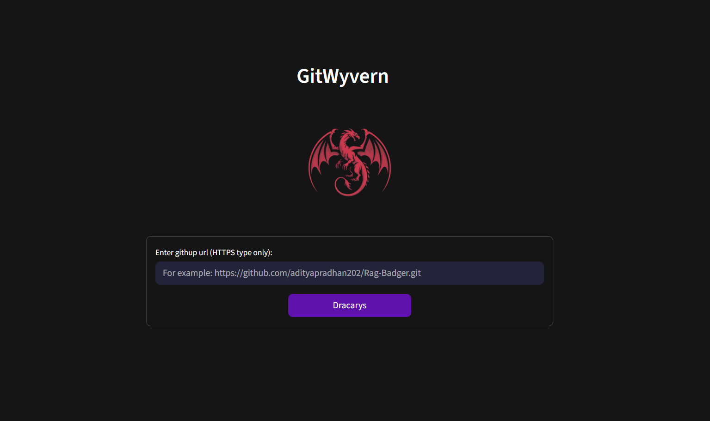
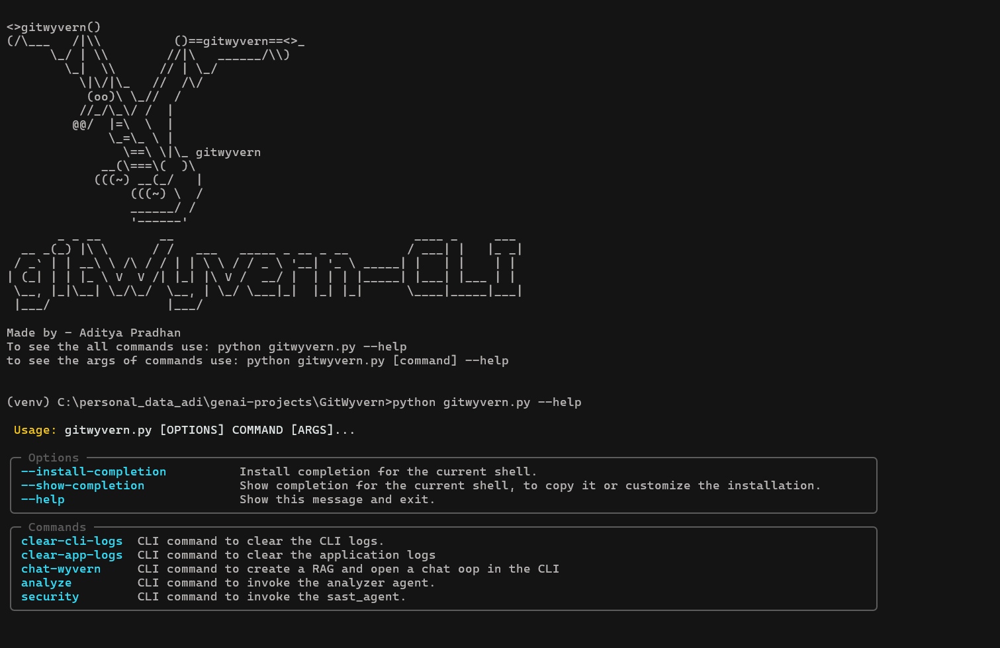

<!--  -->

<h1 align="center">GitWyvern: Scout Python Repos with AI</h1>

<b>Decode Python repositories faster!</b> GitWyvern is an AI-powered repository intelligence system for Python-based repositories. It is a beautifully orchestrated application that uses local LLMs to analyze Python scripts, perform hybrid security scans (SAST + LLM), and create a repo-aware chat system using a RAG pipeline.

<b><a href='#requirements'>Requirements</a> • <a href='#setup-for-windows'>Windows-setup</a> • <a href='#setup-for-docker'>Docker-setup</a> • <a href='#cli-commands'>CLI-commands</a> • <a href="./docs/screenshots.md">App-screenshots</a> </b>

> **Disclaimer:** Also this tool is only for python based repositories. The repository you are trying to analyze must have majority of the code files as .py files.

**For more screenshots - [./docs/screenshots.md](./docs/screenshots.md)**

### Features:
* Smart file-purpose inference from names & signatures (accurate most of the time) for quick codebase overview.
* Hybrid SAST + LLM security scan: detects issues, explains context, suggests fixes.
* RAG-based chat interface with repo knowledge.
* Modular CLI commands for maximum flexibility - use only the features you need (scout, security scan, chat, summary) without running the entire analysis.

### Requirements:
1. Git.
2. Ollama `(Models - qwen2.5:3b, qwen2.5-coder:3b, nomic-embed-text:v1.5)`.
3. Nvidia's Cuda Toolkit. `(Was used for development- Cuda v11.8, CUDNN v8.9, Python v3.12.0)`.
4. Minimum 16GB RAM (8GB RAM available/free) and 4GB VRAM for smooth functioning.
5. **Docker Dekstop (Optional for windows, required for MacOS and Linux)**.

### Setup for Windows:

**Either, clone this repository** or download the windows version from **[Releases](https://github.com/adityapradhan202/GitWyvern/releases/)**.

* Make sure Python is installed on your system. Then open File Explorer, navigate to the root directory of the project, and double-click on `run.bat`.
* Double-click this Windows batch file to launch the GitWyvern GUI. If a virtual environment doesn’t exist, it will be created automatically and the required dependencies will be installed. On subsequent runs, the existing environment will be activated and the app will start at http://localhost:8501 in your default browser.
* To run the CLI version, double-click on `cli.bat`.

### Setup for docker:
> ⚠️ In progress. Yet to be added once verified and tested!

### CLI-commands
* To activate and use the CLI go to the root level of the cloned repository and **double click** on `cli.bat` file. (**This cli.bat file will only work on Windows OS**)
* You can use `python gitwyvern.py --help` to get the list of commands. Use `python gitwyvern.py [command] --help` to see the command line arguments for the specific commands.
* To use the CLI in macOS or Linux, first activate the venv of the project. And use python3 instead of python for the commands mentioned above.

Click here to see the list of CLI commands - [CLI Commands](./docs/cli.md)

### ⭐ Support the project:
A star on the repository is greatly appreciated if you want to show some support.  
~ Made by a developer fighting imposter syndrome.